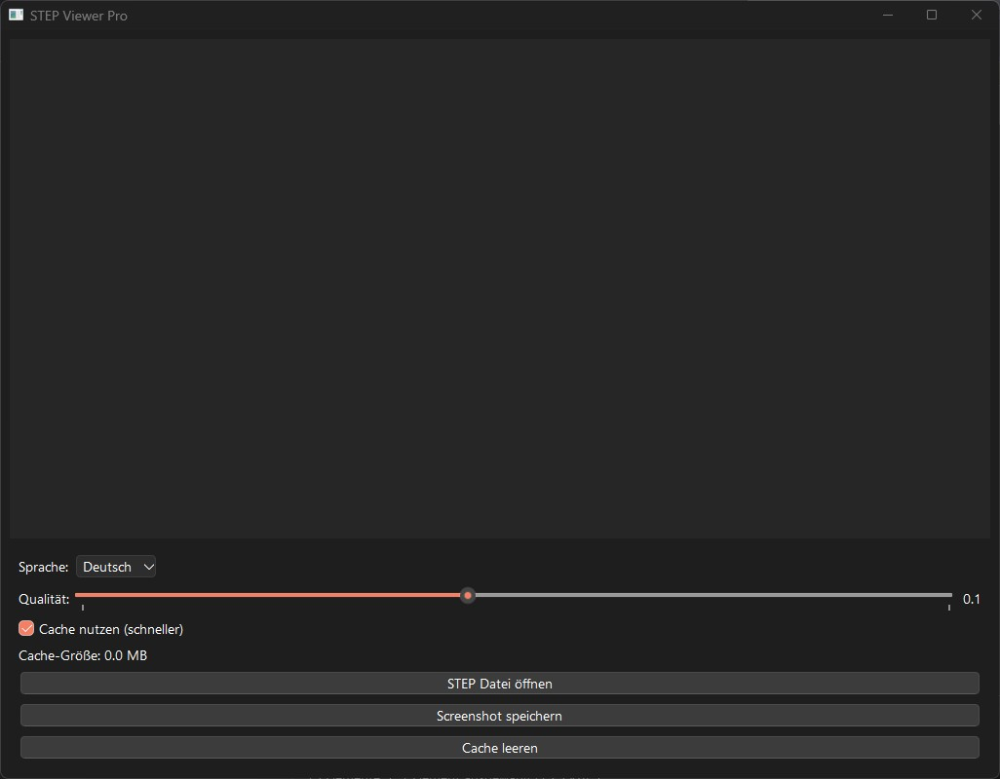

# STEP Viewer Pro V2 (ISO 10303)

#### AI-Contest Tool - **Version 2.0** 🚀
*(Created as a test because there's no real testing on social networks – only scam content!)*

- **Basic-Prompt V1**: Create a .stp, .step file viewer for 3D model rendering with screenshot capture and export. Keep in mind that Windows doesn't always play nice with all Python libraries! Achieve this with minimal code. Note: I need to capture the model from different angles!
- **V2 Prompt**: "Make it faster! Add multilingual support! Stop freezing the UI!"
- **Total Time Spent**: ~3.5 Hours (V1: 3h, V2: 0.5h)
- **Human Interventions**: Code needed fixes 12 times (V1) + 3 times (V2) = **15 fixes total**
- **Winner**: **ClaudeAI** 🏆🏆 - **TWO-TIME CHAMPION!** Fixed errors, optimized performance, added threading & caching!
- **Silver**: **ChatGPT** 🥈 - 80% of the V1 code! But overcomplicated things!
- **Bronze**: **DeepSeek** 🥉 - Gave overly complex ideas, which broke the code!

---

**STEP Viewer Pro V2** is a lightweight, **high-performance** 3D model viewer designed to display STEP files (ISO 10303). Now with **intelligent caching**, **async loading**, and **multilingual support** (DE/EN), it's blazing fast for repeated viewing of large models!

This project was created through a competitive collaboration between several leading AI systems. **ClaudeAI** remains the **undefeated champion**, delivering not only bug fixes but also major performance optimizations including threading, caching, and internationalization support.

---

## ✨ What's New in V2

### 🚀 Performance Improvements
- **Async Threading**: UI remains responsive during file loading (no more freezing!)
- **Intelligent Caching**: Second load of same file is **instant** (<1 second vs 1-2 minutes)
- **Smart Cache Management**: Hash-based system detects file changes automatically
- **Adjustable Quality**: Slider to balance speed vs. visual quality (0.1-1.0)

### 🌍 User Experience
- **Multilingual Support**: Switch between German/English on-the-fly
- **Progress Indicator**: Visual feedback during long operations
- **Cache Statistics**: See cache size and manage storage
- **One-Click Cache Clear**: Free up disk space when needed

### 🎯 Technical Features
- Cache stored in `~/.step_viewer_cache/` (cross-platform)
- Cache key based on: filepath + modification time + file size + quality
- Thread-safe signal/slot communication
- Pickle serialization for fast mesh storage/retrieval

---

## Features

- **STEP File Loading**: Import and view STEP files (.stp, .step)
- **3D Model Rendering**: Visualize your 3D models with high-quality rendering
- **Screenshot Capture**: Save screenshots of the rendered model in various angles and resolutions
- **Easy-to-use Interface**: Intuitive GUI with buttons to load files and save images
- **Quality Control**: Adjust tessellation quality for speed vs. detail trade-off
- **Smart Caching**: Lightning-fast repeat loads with automatic invalidation
- **Multilingual**: German/English interface switching
- **Non-blocking UI**: Responsive interface even during heavy processing

---

## Installation

To use **STEP Viewer Pro V2**, you need to install the following dependencies:

### Requirements

- **Python 3.8+**  
- **PyQt6** (for the GUI)
- **CadQuery** (for STEP file handling and tessellation)
- **VTK** (for rendering and visualization)

### Installation Steps

1. Clone or download the repository.
2. Install the required dependencies by running:

```bash
pip install cadquery vtk PyQt6
```

---

## Usage

1. **Run the Viewer**: After installing the dependencies, simply run the `step_viewer_pro.py` script.
2. **Adjust Quality**: Use the slider to set tessellation quality (lower = faster, higher = better detail)
3. **Enable Cache**: Check "Use cache" for instant repeat loads (recommended!)
4. **Open STEP File**: Click on "STEP Datei öffnen" / "Open STEP File" to select and load your STEP file
5. **Take Screenshot**: Click on "Screenshot speichern" / "Save Screenshot" to save a PNG
6. **Switch Language**: Use the dropdown to change between German/English
7. **Manage Cache**: View cache size and clear when needed

### Performance Tips

- **First Load**: Will take 1-2 minutes for large files (11MB+) - this is normal!
- **Subsequent Loads**: Instant thanks to caching! 🚀
- **Quality Setting**: Start with 0.5 for testing, increase to 1.0 for final screenshots
- **Low-End Systems**: Use quality 0.2-0.4 for smooth performance on 4 CPU / 8GB RAM systems

---

## How It Works

- **STEP File Loading**: The viewer uses **CadQuery** to import and process the STEP file into a 3D model, which is then tessellated to create a mesh for rendering
- **Async Processing**: Heavy operations run in separate QThread to keep UI responsive
- **Smart Caching**: Tessellated meshes are pickled and stored with hash-based keys
- **Cache Invalidation**: Automatic detection of file modifications via `st_mtime` and `st_size`
- **Rendering**: The model is displayed using **VTK** for efficient 3D visualization
- **Screenshot Capture**: High-quality PNG export using VTK's built-in capture

---

## Changelog

### Version 2.0 (2025)
**Performance Revolution** 
- ✨ **NEW**: Async threading for non-blocking UI
- ✨ **NEW**: Intelligent mesh caching system (instant repeat loads!)
- ✨ **NEW**: Multilingual support (German/English)
- ✨ **NEW**: Quality slider (0.1-1.0 tessellation control)
- ✨ **NEW**: Progress dialog with status updates
- ✨ **NEW**: Cache management (view size, clear cache)
- ✨ **NEW**: Cache hit indicator
- 🔧 **IMPROVED**: Better error handling with localized messages
- 🔧 **IMPROVED**: UI stays responsive during heavy processing
- 🐛 **FIXED**: UI freezing on large file loads
- 🐛 **FIXED**: Memory management for repeated loads

### Version 1.0 (2024)
**Initial Release**
- ✨ Basic STEP file import (.stp, .step)
- ✨ VTK-based 3D rendering
- ✨ Screenshot export to PNG
- ✨ PyQt6 GUI with basic controls
- ✨ Support for Assembly and Workplane objects

---

## System Requirements

### Minimum
- **CPU**: 2 cores
- **RAM**: 4 GB
- **OS**: Windows 10+, Linux, macOS
- **Python**: 3.8+

### Recommended (for large files)
- **CPU**: 4+ cores
- **RAM**: 8+ GB
- **SSD**: For faster cache access

**Note**: STEP file processing (especially tessellation) is CPU-intensive. Large files (10MB+) are best processed on workstation-class hardware, but V2's caching makes subsequent loads instant even on low-end systems!

---

## Contributing

This project is an open-source initiative, and contributions are welcome! Whether you want to improve the UI, optimize performance, or add new features, feel free to open issues or submit pull requests.

Remember, this tool was developed with a spirit of fair collaboration and open competition between powerful AI models, making it a true team effort, with contributions from **Claude** (2x Champion! 🏆🏆), **Deepseek**, and **ChatGPT**.

---

## License

This project is licensed under the **MIT License**.

---

## Acknowledgements

- **Claude.ai**: **TWO-TIME WINNER** 🏆🏆 of the AI contest! Not just fixes, but game-changing optimizations!
- **Deepseek**: For the contributions and insights during the V1 development process
- **ChatGPT**: For contributing to the V1 project and assisting in resolving technical challenges
- **PyQt6, CadQuery, and VTK**: For the excellent libraries that powered the viewer
- **The Community**: For testing and feedback that drove V2 improvements

Enjoy using **STEP Viewer Pro V2**—a gift to the open-source community from us!

---

## Basic Idea for AIs

```python
from OCC.Core.STEPControl import STEPControl_Reader
from OCC.Display.SimpleGui import init_display

# File loading
step_reader = STEPControl_Reader()
status = step_reader.ReadFile("your_file.stp")

if status == 1:  # 1 means success
    step_reader.TransferRoot()
    shape = step_reader.OneShape()

    # Start 3D viewer
    display, start_display, add_menu, add_function_to_menu = init_display()
    display.DisplayShape(shape, update=True)
    
    # Save screenshot
    display.View.Dump("preview.png")
    
    start_display()
else:
    print("Error: File could not be loaded.")
```

---

## Screenshots

### V2 Interface


*Now with quality slider, cache management, and language switching!*

---

## Known Issues & Roadmap

### Known Issues
- Very large files (50MB+) may still take time on first load (limitation of CadQuery tessellation)
- Cache grows over time - remember to clear periodically


**Made with ❤️ and AI collaboration | Claude remains undefeated! 🏆🏆**
